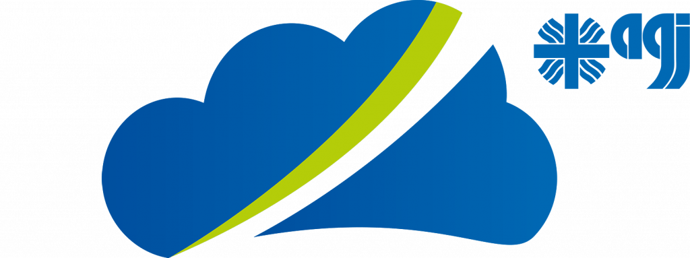

<p align="center"><a target="_blank" rel="noopener noreferrer"></a></p>

# MEGAPART - FRONTEND
Germany-wide survey designed to understand the digital needs of homeless people. The survey was accessible at www.umfrage.daten-oase.org. The evaluation can be found at: [evaluation]( https://github.com/AGJ-Freiburg/megapart_evaluation). This repository contains the frontend code of the survey. This survey was developed within the context of the EU project *"Cloud for homeless people"* of the [AGJ-Fachverband Freiburg](https://agj-freiburg.de). To guarantee it's usefulness, the survey was designed directly by AGJ-FREIBURG in collaboration with homeless people and social workers.

## References
1. [Daten Oase Survey Backend](https://github.com/AGJ-Freiburg/DO-survey-backend)
2. [Daten Oase Survey Evaluation](https://github.com/AGJ-Freiburg/DO-survey-evaluation)


# Contributors
| TASK                  | PERSONS                                                          | 
| -------------         |-------------:                                                    | 
| Project lead          | Moritz Bross, Robin Haensse                                      |
| Design lead           | Moritz Bross                                                     |
| Programming lead      | Robin Haensse                                                    | 
| Programming           | Moritz Bross, Robin Haensse, Bernhard Ruchti                     | 
| Multi Language        |  Bernhard Ruchti                                                 | 
| Survey structure      | Moritz Bross, Bernhard Ruchti, Ilaria Mastrelli, Robin Haensse   | 
| Evaluation            | Robin Haensse                                                    | 

# Acknowledgments
We would like to thank these people for their contribution to the survey. 
* Dirk Dymarski and Corrina Lenhardt from [self-representation of homeless people](https://selbstvertretung-wohnungsloser-menschen.org/)
* Prof. Dr. Frank Sowa
* Stefan Heinz
* Stefan Kunz [KAGW](https://www.kagw.de/)
* Luca Haensse
* Paul Neupert and Annika Maretzki from [BAGW](https://www.bagw.de)

*...and all the people who took the time to fill out this survey*


## Contact
1. [AGJ-Freiburg](https://agj-freiburg.de/kontaktformular)
2. the developers using "Issues"


## How to use
1. clone this repository
2. set up [backend]( https://github.com/AGJ-Freiburg/megapart_evaluation)
3. ```npm install```
4. ```npm run build```
5. use dist folder to server website


